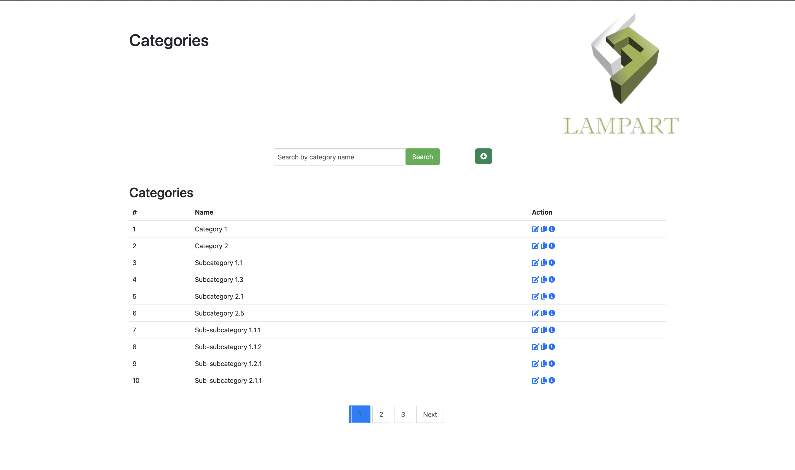

# Category Web

 

Link to try the project: [Category Web](https://categoriesnn.000webhostapp.com/)

This project is a category management web application implemented using PHP, MySQL, and the MVC (Model-View-Controller) architectural pattern. It allows users to manage categories with hierarchical relationships, perform CRUD (Create, Read, Update, Delete) operations, search categories by name, and paginate the results.
 

## Installation and Setup

To set up the project, follow these steps:

1. Install PHP 8.2.7, MySQL, and phpMyAdmin on your local machine.
2. Clone this repository to your desired directory.
3. Open the `database.php` file and update the database connection settings (`$dbhost`, `$dbuser`, `$dbpass`, `$db`, `$dbport`) according to your environment.
4. Create a new database named `category_management` in phpMyAdmin.
5. Import the database schema from the provided SQL file into the `category_management` database(database file is formatted as JSON, remember to convert to sql if necessary).
6. Start your local web server (e.g., Apache) and ensure it is configured to run PHP files.
7. Access the application by opening a web browser and navigating to the URL where the project is hosted (e.g., `http://localhost/category-web`).

## Project Execution

The entry point of the application is `index.php`, which renders the `CategoryManagementView`. This view displays a list of categories with their code, name, and parent category. From this view, you can perform various actions:

- Edit: Clicking on the "Edit" button next to a category opens the `EditCategoryView`, where you can modify the category's code, name, and parent category and save the changes.

- Add New: Clicking on the "Add New" button opens the `AddCategoryView`, allowing you to enter the code, name, and parent category for a new category and save it.
- Copy: Clicking on the "Copy" button next to a category opens the `CopyCategoryView`, where you can select a category to copy and specify the new code, name, and parent category for the copy.
- Details: Clicking on the "Details" button next to a category opens the `CategoryDetailsView`, which shows detailed information about the category, including its code, name, parent category, and child categories.

The application supports searching for categories by name. You can enter a category name in the provided search field to filter the list based on the entered name.

The categories are displayed in a hierarchical format, where a category can have multiple child categories, and each child category can have multiple other child categories. The depth of the category hierarchy is dynamic and unlimited.

Bootstrap and Font Awesome are used for styling the web pages, providing a clean and responsive user interface.

## Dependencies

The project relies on the following dependencies:

- PHP 8.2.7 (cli) (built: Jun 15 2023 01:29:09) (NTS)
- phpMyAdmin
- MySQL
- Bootstrap
- Font Awesome

Please make sure these dependencies are installed and configured properly in your environment before running the project.